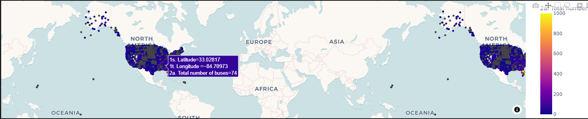
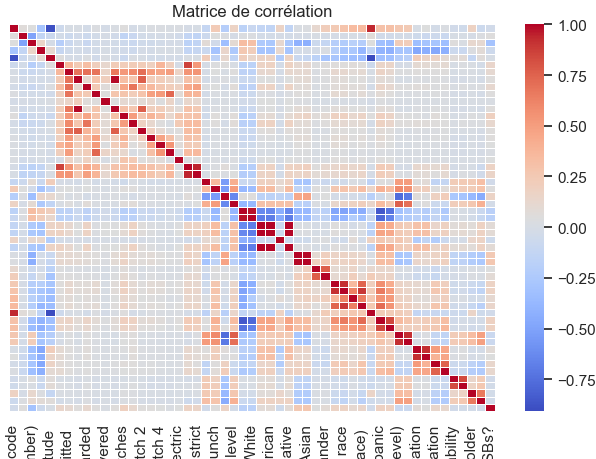

# 🚌 Unsupervised Exploration of the Electric School Bus Adoption Dataset (On going)  

## 📌 Overview

This project explores the adoption of **Electric School Buses (ESBs)** across school districts in the United States using **unsupervised machine learning** techniques. 
The dataset, compiled by the **World Resources Institute (WRI)**, provides detailed insights into bus procurement, socio-economic context, and progress through adoption phases.

The goal is to uncover **hidden patterns, trends, and groupings** among districts to better understand the landscape and equity of ESB adoption.

---

## 📂 Project Structure

├── electric school bus adoption/ # Raw and cleaned datasets  
├── Notebooks # Jupyter notebooks for EDA, and visualizations  
├── ML Notebooks # Jupyter notebooks for EDA, clustering  
├── README.md # Project overview and instructions  
└── requirements.txt # List of dependencies (will be added)

---

## 🧠 Objectives

- Perform **exploratory data analysis** (EDA) to understand key variables and distributions.
- Use **dimensionality reduction** (PCA, t-SNE) to visualize district similarities.
- Apply **clustering algorithms** (e.g., K-Means, DBSCAN) to group districts based on adoption behavior and demographics.
- Analyze **anomalies or outliers** in ESB adoption patterns.
- Investigate **relationships between equity indicators** (e.g., poverty rate) and adoption clusters.

---

## 📊 Dataset Overview

The dataset includes:

- **District Demographics**: Poverty rate, racial makeup, locale (urban, rural, etc.), air quality, student population.
- **Bus Details**: Number of ESBs, manufacturer, funding source.
- **Adoption Timeline**: Phases for each bus – awarded, ordered, delivered, operating.
- **Geographic Features**: Latitude/longitude, state, region.

---

## 🛠️ Tools & Libraries

- Python (3.8+)
- Pandas, NumPy
- Scikit-learn
- Seaborn, Matplotlib, Plotly
- Scipy
- UMAP, t-SNE (from sklearn or openTSNE)

---

